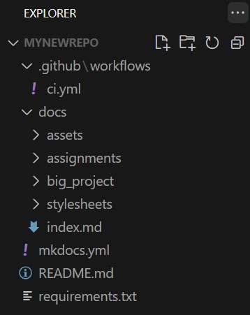
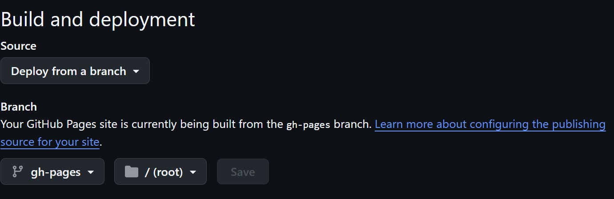

## MkDocs - GitHub Pages website

Instructions on how to make a GitHub repo visible on a website through GitHub Pages like this one [MkDocsGitHubPagesTemplate](https://fablabreykjavik.github.io/MkDocsGitHubPagesTemplate/)

### Instructions

Start by creating a new GitHub repo and name it something like "MyNewRepo" and make sure it is Public. 

Clone this repo

```
git clone https://github.com/FabLabReykjavik/MkDocsGitHubPagesTemplate.git
```

Copy the contents of this repo into your newly created "MyNewRepo"

The folder structure for "MyNewRepo" should look something like this



Push the changes to your new repo.

Go to you repo on the github.com and under Settings - Pages and under Build and Deployment use these settings



Make some changes in you repo and push the changes. If all goes well you should be able to see you new repo as a MkDocs website on https://YourUserName.github.io/MyNewRepo/
